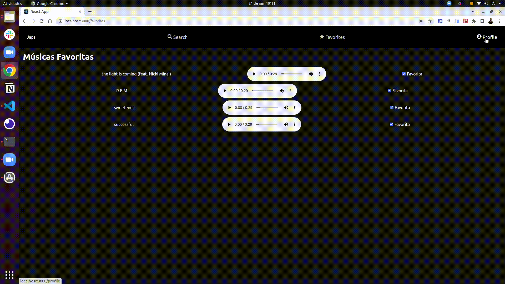

# JS Tunes

# O que é o JS Tunes

Esta é uma aplicação capaz de reproduzir músicas das mais variadas bandas e artistas, criar uma lista de músicas favoritas e editar o perfil da pessoa usuária logada.

## Técnologias usadas

Front-end:
> Desenvolvido usando: React, CSS3, HTML5, ES6


## Instalando Dependências

> Basta executar o comando abaixo no seu terminal
```bash
npm install
``` 

## Executando aplicação
* Para rodar a aplicação execute:

  ```
  npm start
  ```

## Gifs de demonstração do projeto
- Login pesquisa de albuns, favoritando músicas e desfavoritando


- Tela de profile, edição de profile e visualização de profile editado



Este projeto foi desenvolvido por [João Antônio](https://www.linkedin.com/in/joaoantoniosilvaa/) durante o curso de Desenvolvimento de Software na [Trybe](https://www.betrybe.com/) 